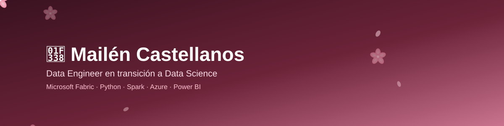

### Hi there 🌸

- 🌱 Estoy en transición de **Arquitecta de Datos** hacia **Data Scientist**, cursando la Licenciatura en Ciencia de Datos en la Universidad Siglo 21.
- 💼 Trabajo en **Arredo**, liderando técnicamente al equipo de Ingeniería de Datos y diseñando arquitectura *medallion* en **Microsoft Fabric**.
- 📊 Me gusta transformar datos crudos en información clara: modelado, ETL, dashboards y, cada vez más, análisis predictivo.
- 🌸 Antes pasé por **Compañía de Servicios Farmacéuticos**, **Softtek** e **IBM**.

### 🌸 Algunos de mis proyectos

| Repositorio | Descripción |
|---|---|
| [Databricks_movie_history](https://github.com/MailenMay/Databricks_movie_history) | Análisis exploratorio de datos históricos de películas con PySpark y Databricks Notebooks |
| [Databricks-Telco](https://github.com/MailenMay/Databricks-Telco) | Prácticas de Unity Catalog y arquitectura medallion (bronze/silver/gold) en Databricks |
| [adf-movie-history](https://github.com/MailenMay/adf-movie-history) | Pipelines de ingesta y transformación de datos con Azure Data Factory |
| [Jupyter_Notebooks](https://github.com/MailenMay/Jupyter_Notebooks) | Notebooks de estadística descriptiva, Pandas, NumPy y visualización de datos |
| [POO](https://github.com/MailenMay/POO) | Ejercicios de programación orientada a objetos en Python, Java, JS y PHP |

### Mi stack

### Sígueme 🌸

*Gracias por pasar por mi perfil 🌸*
